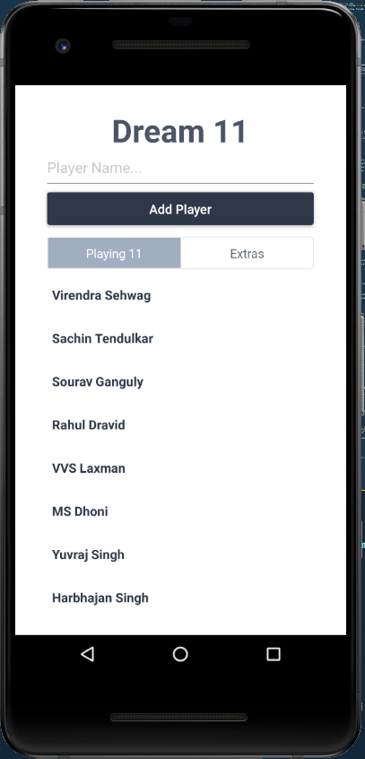
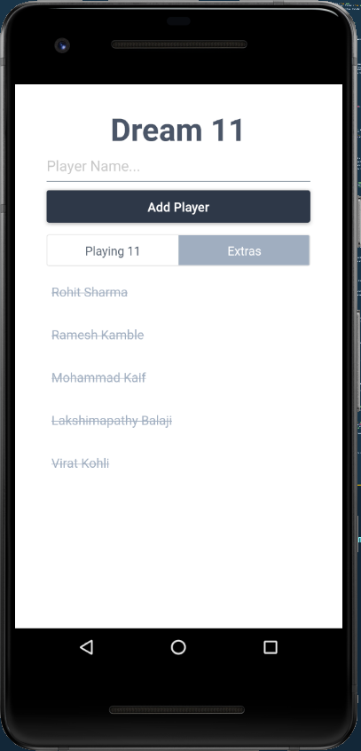

# expo-mobx

> Dream11 app in Expo using Mobx

## Screenshots

### Playing 11



### Extras



# Clone the repo

```bash
$ git clone git@github.com:deadcoder0904/expo-mobx.git
```

# Install the dependencies

```bash
$ yarn
```

# Run the app

```bash
$ yarn start
```

# License

MIT © [Akshay Kadam](https://twitter.com/deadcoder0904)